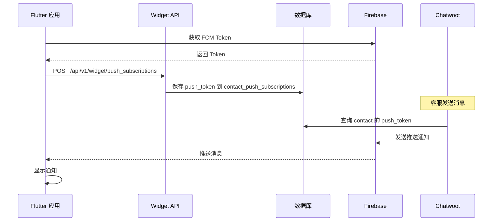

# Flutter Widget 推送通知实现指南

## 🎯 概述

本指南说明如何在 Flutter Widget 应用中实现 Chatwoot 推送通知，让客户能够接收客服发送的消息。

## 📋 前置要求

1. ✅ Chatwoot 服务器已配置 Firebase（`FIREBASE_PROJECT_ID` 和 `FIREBASE_CREDENTIALS`）
2. ✅ Firebase 项目已创建并获取 `google-services.json`
3. ✅ 数据库已运行迁移：`bundle exec rails db:migrate`

## 🏗️ 架构流程



## 📦 依赖配置

### pubspec.yaml

```yaml
dependencies:
  flutter:
    sdk: flutter
  firebase_core: ^3.8.1
  firebase_messaging: ^15.1.5
  flutter_local_notifications: ^18.0.1
  http: ^1.2.0
  shared_preferences: ^2.3.3
```

运行：`flutter pub get`

## 🔧 Android 配置

### 1. android/build.gradle

```gradle
buildscript {
    dependencies {
        classpath 'com.google.gms:google-services:4.4.0'
    }
}
```

### 2. android/app/build.gradle

```gradle
plugins {
    id 'com.android.application'
    id 'kotlin-android'
    id 'com.google.gms.google-services'
}

dependencies {
    implementation platform('com.google.firebase:firebase-bom:32.7.0')
    implementation 'com.google.firebase:firebase-messaging'
}
```

### 3. 添加 google-services.json

将 Firebase Console 下载的 `google-services.json` 放到 `android/app/` 目录。

### 4. android/app/src/main/AndroidManifest.xml

```xml
<manifest xmlns:android="http://schemas.android.com/apk/res/android">
    <uses-permission android:name="android.permission.INTERNET"/>
    <uses-permission android:name="android.permission.POST_NOTIFICATIONS"/>

    <application>
        <!-- 通知渠道 ID -->
        <meta-data
            android:name="com.google.firebase.messaging.default_notification_channel_id"
            android:value="chatwoot_messages" />
    </application>
</manifest>
```

## 💻 核心代码实现

### 1. 推送通知服务 (lib/services/push_notification_service.dart)

```dart
import 'dart:convert';
import 'package:firebase_core/firebase_core.dart';
import 'package:firebase_messaging/firebase_messaging.dart';
import 'package:flutter_local_notifications/flutter_local_notifications.dart';
import 'package:http/http.dart' as http;
import 'package:shared_preferences/shared_preferences.dart';

// 后台消息处理（必须是顶级函数）
@pragma('vm:entry-point')
Future<void> _firebaseBackgroundHandler(RemoteMessage message) async {
  await Firebase.initializeApp();
  print('后台消息: ${message.notification?.title}');
}

class PushNotificationService {
  static final FirebaseMessaging _messaging = FirebaseMessaging.instance;
  static final FlutterLocalNotificationsPlugin _localNotifications =
      FlutterLocalNotificationsPlugin();

  static String? _fcmToken;
  static String? _chatwootBaseUrl;
  static String? _websiteToken;

  /// 初始化推送服务
  static Future<void> initialize({
    required String chatwootBaseUrl,
    required String websiteToken,
  }) async {
    _chatwootBaseUrl = chatwootBaseUrl;
    _websiteToken = websiteToken;

    // 请求通知权限
    NotificationSettings settings = await _messaging.requestPermission(
      alert: true,
      badge: true,
      sound: true,
    );

    if (settings.authorizationStatus != AuthorizationStatus.authorized) {
      print('⚠️ 用户未授予通知权限');
      return;
    }

    // 初始化本地通知
    await _initLocalNotifications();

    // 获取 FCM Token
    _fcmToken = await _messaging.getToken();
    print('✅ FCM Token: $_fcmToken');

    // Token 刷新监听
    _messaging.onTokenRefresh.listen((newToken) {
      print('🔄 Token 刷新: $newToken');
      _fcmToken = newToken;
    });

    // 设置消息处理
    FirebaseMessaging.onBackgroundMessage(_firebaseBackgroundHandler);
    FirebaseMessaging.onMessage.listen(_handleForegroundMessage);
    FirebaseMessaging.onMessageOpenedApp.listen(_handleMessageTap);

    // 检查初始消息
    RemoteMessage? initialMessage = await _messaging.getInitialMessage();
    if (initialMessage != null) {
      _handleMessageTap(initialMessage);
    }
  }

  /// 初始化本地通知
  static Future<void> _initLocalNotifications() async {
    const androidSettings = AndroidInitializationSettings('@mipmap/ic_launcher');
    const settings = InitializationSettings(android: androidSettings);

    await _localNotifications.initialize(
      settings,
      onDidReceiveNotificationResponse: (response) {
        if (response.payload != null) {
          final data = json.decode(response.payload!);
          print('通知点击数据: $data');
          // TODO: 导航到对话页面
        }
      },
    );

    // 创建通知渠道
    const channel = AndroidNotificationChannel(
      'chatwoot_messages',
      '客服消息',
      description: '接收客服回复',
      importance: Importance.high,
    );

    await _localNotifications
        .resolvePlatformSpecificImplementation<
            AndroidFlutterLocalNotificationsPlugin>()
        ?.createNotificationChannel(channel);
  }

  /// 处理前台消息
  static void _handleForegroundMessage(RemoteMessage message) {
    print('📨 前台消息: ${message.notification?.title}');
    _showNotification(message);
  }

  /// 显示本地通知
  static Future<void> _showNotification(RemoteMessage message) async {
    const androidDetails = AndroidNotificationDetails(
      'chatwoot_messages',
      '客服消息',
      importance: Importance.high,
      priority: Priority.high,
    );

    const details = NotificationDetails(android: androidDetails);

    await _localNotifications.show(
      message.hashCode,
      message.notification?.title ?? '新消息',
      message.notification?.body ?? '',
      details,
      payload: json.encode(message.data),
    );
  }

  /// 处理通知点击
  static void _handleMessageTap(RemoteMessage message) {
    print('👆 通知被点击: ${message.data}');
    // TODO: 根据数据导航到对话页面
  }

  /// 注册推送 Token 到服务器
  static Future<bool> registerPushToken({
    required String contactIdentifier,
    String? deviceId,
  }) async {
    if (_fcmToken == null) {
      print('❌ FCM Token 未就绪');
      return false;
    }

    try {
      final prefs = await SharedPreferences.getInstance();

      final response = await http.post(
        Uri.parse('$_chatwootBaseUrl/api/v1/widget/push_subscriptions'),
        headers: {
          'Content-Type': 'application/json',
        },
        body: json.encode({
          'website_token': _websiteToken,
          'contact_identifier': contactIdentifier,
          'push_subscription': {
            'push_token': _fcmToken,
            'device_id': deviceId ?? await _getDeviceId(),
            'platform': 'android',
          }
        }),
      );

      if (response.statusCode == 201 || response.statusCode == 200) {
        print('✅ 推送 Token 注册成功');
        await prefs.setString('registered_push_token', _fcmToken!);
        return true;
      } else {
        print('❌ 注册失败: ${response.statusCode} - ${response.body}');
        return false;
      }
    } catch (e) {
      print('❌ 注册错误: $e');
      return false;
    }
  }

  /// 取消推送订阅
  static Future<bool> unregisterPushToken() async {
    if (_fcmToken == null) return false;

    try {
      final response = await http.delete(
        Uri.parse('$_chatwootBaseUrl/api/v1/widget/push_subscriptions'),
        headers: {
          'Content-Type': 'application/json',
        },
        body: json.encode({
          'website_token': _websiteToken,
          'push_token': _fcmToken,
        }),
      );

      if (response.statusCode == 200) {
        print('✅ 取消订阅成功');
        final prefs = await SharedPreferences.getInstance();
        await prefs.remove('registered_push_token');
        return true;
      }
      return false;
    } catch (e) {
      print('❌ 取消订阅错误: $e');
      return false;
    }
  }

  /// 获取或生成设备 ID
  static Future<String> _getDeviceId() async {
    final prefs = await SharedPreferences.getInstance();
    String? deviceId = prefs.getString('device_id');

    if (deviceId == null) {
      deviceId = DateTime.now().millisecondsSinceEpoch.toString();
      await prefs.setString('device_id', deviceId);
    }

    return deviceId;
  }

  /// 获取当前 Token
  static String? get fcmToken => _fcmToken;
}
```

### 2. 主应用入口 (lib/main.dart)

```dart
import 'package:flutter/material.dart';
import 'package:firebase_core/firebase_core.dart';
import 'services/push_notification_service.dart';

void main() async {
  WidgetsFlutterBinding.ensureInitialized();

  // 初始化 Firebase
  await Firebase.initializeApp();

  // 初始化推送服务
  await PushNotificationService.initialize(
    chatwootBaseUrl: 'https://your-chatwoot-server.com',
    websiteToken: 'YOUR_WEBSITE_TOKEN',
  );

  runApp(MyApp());
}

class MyApp extends StatelessWidget {
  @override
  Widget build(BuildContext context) {
    return MaterialApp(
      title: 'Chatwoot 客服',
      theme: ThemeData(primarySwatch: Colors.blue),
      home: ChatWidget(),
    );
  }
}

class ChatWidget extends StatefulWidget {
  @override
  _ChatWidgetState createState() => _ChatWidgetState();
}

class _ChatWidgetState extends State<ChatWidget> {
  bool _isRegistered = false;

  Future<void> _registerPush() async {
    final success = await PushNotificationService.registerPushToken(
      contactIdentifier: 'user@example.com', // 用户邮箱或唯一标识
    );

    setState(() {
      _isRegistered = success;
    });

    ScaffoldMessenger.of(context).showSnackBar(
      SnackBar(
        content: Text(success ? '✅ 推送通知已开启' : '❌ 开启失败'),
        backgroundColor: success ? Colors.green : Colors.red,
      ),
    );
  }

  @override
  Widget build(BuildContext context) {
    return Scaffold(
      appBar: AppBar(title: Text('客服聊天')),
      body: Center(
        child: Column(
          mainAxisAlignment: MainAxisAlignment.center,
          children: [
            Text(
              'FCM Token:',
              style: TextStyle(fontWeight: FontWeight.bold, fontSize: 16),
            ),
            SizedBox(height: 8),
            Padding(
              padding: EdgeInsets.all(16),
              child: SelectableText(
                PushNotificationService.fcmToken ?? '获取中...',
                style: TextStyle(fontSize: 12, fontFamily: 'monospace'),
              ),
            ),
            SizedBox(height: 24),
            ElevatedButton.icon(
              onPressed: _isRegistered ? null : _registerPush,
              icon: Icon(_isRegistered ? Icons.check : Icons.notifications),
              label: Text(_isRegistered ? '已开启推送' : '开启推送通知'),
              style: ElevatedButton.styleFrom(
                padding: EdgeInsets.symmetric(horizontal: 32, vertical: 16),
              ),
            ),
          ],
        ),
      ),
    );
  }
}
```

## 🚀 使用步骤

### 1. 服务器准备

确保数据库已迁移：

```bash
cd /home/chatwoot1/chatwoot
bundle exec rails db:migrate
```

### 2. Flutter 项目设置

```bash
# 添加依赖
flutter pub get

# 确保 google-services.json 在 android/app/ 目录
```

### 3. 运行应用

```bash
flutter run
```

### 4. 注册推送

1. 应用启动后会自动请求通知权限
2. 点击"开启推送通知"按钮注册设备
3. 成功后，服务器会保存 FCM Token

### 5. 测试推送

让客服在 Chatwoot 后台发送消息，您的应用应该会收到推送通知。

## 📊 API 端点说明

### 注册推送订阅

```http
POST /api/v1/widget/push_subscriptions
Content-Type: application/json

{
  "website_token": "WEBSITE_TOKEN",
  "contact_identifier": "user@example.com",
  "push_subscription": {
    "push_token": "FCM_DEVICE_TOKEN",
    "device_id": "unique-device-id",
    "platform": "android"
  }
}
```

**响应**: `201 Created`

### 取消推送订阅

```http
DELETE /api/v1/widget/push_subscriptions
Content-Type: application/json

{
  "website_token": "WEBSITE_TOKEN",
  "push_token": "FCM_DEVICE_TOKEN"
}
```

**响应**: `200 OK`

## 🔍 调试技巧

### 查看 Android 日志

```bash
adb logcat | grep -i firebase
```

### 查看服务器日志

```bash
tail -f /home/chatwoot1/chatwoot/log/production.log | grep -i push
```

### 检查数据库

```sql
SELECT * FROM contact_push_subscriptions;
```

## ⚠️ 常见问题

### 1. 收不到推送通知？

- ✅ 检查 Firebase 配置是否正确
- ✅ 确认设备已成功注册（查看数据库）
- ✅ 检查通知权限是否授予
- ✅ 查看服务器日志是否有错误

### 2. Token 注册失败？

- 检查 `website_token` 是否正确
- 确认 API 端点 URL 正确
- 查看网络连接状态

### 3. 后台收不到通知？

- 检查设备电池优化设置
- 确认后台消息处理器已配置
- 测试前台和后台接收情况

## 📚 相关文件

- **服务器端**:
  - [push_subscriptions_controller.rb](file:///home/chatwoot1/chatwoot/app/controllers/api/v1/widget/push_subscriptions_controller.rb)
  - [contact_push_subscription.rb](file:///home/chatwoot1/chatwoot/app/models/contact_push_subscription.rb)
  - [数据库迁移](file:///home/chatwoot1/chatwoot/db/migrate/20260108140933_create_contact_push_subscriptions.rb)

## 🎯 下一步

- 实现消息点击后的页面导航
- 添加通知声音和振动自定义
- 实现通知分组功能
- 添加推送统计分析
